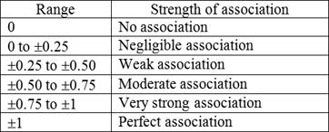
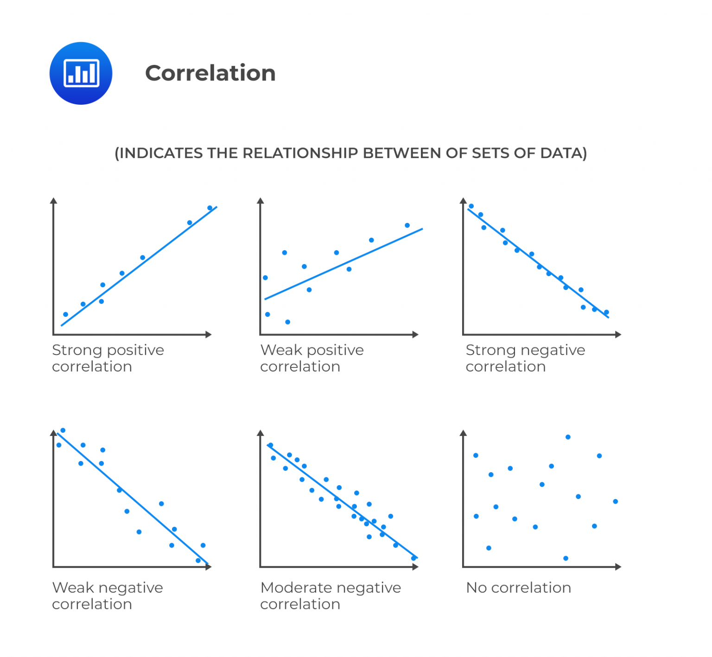

```{r setup, include=FALSE}
# clear-up the environment
rm(list = ls())

# chunk options
knitr::opts_chunk$set(
  message = FALSE,
  warning = FALSE,
  fig.align = "center",
  comment = "#>"
)
```

```{=html}
<style>
body {
text-align: justify}
</style>
```

# What's On Spotify

Spotify said listening is everything. It also said Spotify is all the music you will ever need. Spotify has huge catalog of songs and podcasts. I wonder what people listen in 2020-2021, which it's pandemic era. What about the correlation between Artist, their Spotify account's followers, and listeners. Let's find out.

```{r}
knitr::include_graphics('Spotify_img')
```

## Music Around The World

The world listen to music all the time. Many of them use Spotify as app they use to listen music daily. Spotify is no. 1 music streaming platform by number of subscribers. Based on company data, Spotify has 299 million unique in Q2 2020. The number grow from time to time. Spotify still on top of people's mind. Other music streaming service are Apple Music, Amazon Music, Youtube, and many more.

```{r}
knitr::include_graphics("Spotify's Annual Users.PNG")
```

This Spotify dataset is from kaggle. The period of dataset is 2020-2021. We are going analyize further about Top 200 charts in Spotify.

```{r}
# Read Data
spotify <- read.csv('spotify_dataset.csv')

# Read 3 rows of data to check what's inside
head(spotify,3)
```

```{r}
# Check the data structure

str(spotify)
```

## Get Only What needed

The dataset still looks too much to use. I simplify by only take columns I need. I only take :\
1. Artist\
2. Song Name\
3. Streams\
4. Artist Followers\
5. Highest Charting Position\
6. Number of Times Charted\
7. Release Date\

```{r}
# Get Column that we needed

spotify_ds <- spotify[,c('Artist','Song.Name','Streams', 'Artist.Followers', 'Highest.Charting.Position','Number.of.Times.Charted','Release.Date')]
library(lubridate)
spotify_ds$Release.Date <- ymd(spotify_ds$Release.Date)
head(spotify_ds,3)
```

```{r}
# Get how many data in dataset
nrow(spotify_ds)
```

```{r}
# Get Summary of dataset
summary(spotify_ds)
```

We are going to analyze 1556 variant of songs in Spotify. We are trying to find out more about about Spotify's dataset.

# Top Artist and Their Followers

Let's see the correlation between song's chart position and their Spotify-account's followers. We know that the more followers you have, the more people goint to listen. Is that true in this case ?
\
Here an Histogram of Artist's Followers
\
```{r}
# Make Histogram
Artist_Followers <- spotify_ds$Artist.Followers
hist(Artist_Followers, breaks = 200, main = 'Histogram of Spotify Artist Followers',
     xlab = 'Followers',
     cex.main=2, cex.lab=1.5, cex.sub=1.2)
```

```{r}
# Change Artist.Followers to numeric
spotify_ds$Artist.Followers <- as.numeric(spotify_ds$Artist.Followers)

# Aggregate to get Artist followers ranking
agg_df <- aggregate(x=Artist.Followers ~ Artist, data= spotify_ds, FUN=max)
agg_df[order(agg_df$Artist.Followers, decreasing = T),]

```

\
We can see how diverse their followers numbers from histogram. Then, from the table, we get Ed Sheeran, Ariana Grande, and Drake on Top 3. Ed Sheeran has 83 millions followers from his account. He is Artist with the most followers in 2021.\

```{r}
# Remove comma from Streams then change Streams datatype to numeric
spotify_ds$Streams <- as.numeric(gsub(",","",spotify_ds$Streams))

# Aggregate to get Artist' song streams ranking
agg_df <- aggregate(x=Streams ~ Artist, data= spotify_ds, FUN=sum)
agg_df[order(agg_df$Streams, decreasing = T),]

```

\
in 2020-2021, The top 3 stream artist are Taylor Swift, BTS, and Justin Bieber. There many reason why not the most followers get the most streams in this period year. One of few is they didn't drop any new song or album. Is it true that no correlation between artist's followers and their stream number ? Then how about highest chart postion and number of time charted. Let's find out more about that.\

# The Correlation

## Artist Followers and Streams

```{r}
# Check missing value
anyNA(spotify_ds)

# Drop row with missing value 
spotify_ds <- na.omit(spotify_ds)

# Calculate correlation
cor(spotify_ds$Artist.Followers, spotify_ds$Streams)
```

The correlation is 0.104. What is that mean ? Take a look at the table below.

```{r}

```

\
> The conclucion is the correlation between Artist followers and streams is negligible. Two of them almost has no correlation. In period 2020-2021, People who use spotify listen the song they like whether many of them not follow the artist.

```{r}
# Plot Artist Followers and Streams
plot(spotify_ds$Artist.Followers, spotify_ds$Stream,
     main='Followers vs Stream',
     xlab = 'Followers',
     ylab = 'Stream',
     cex.main=2, cex.lab=1.5, cex.sub=1.2)

abline(lm(spotify_ds$Streams ~ spotify_ds$Artist.Followers), 
      col = 'red')
```

\
Find out more about correlation between of sets of data scatter plot below.

```{r}

```

> Base on the scatter plot, the correlation between Artist followers and stream have weak positive correlation. But, it's very weak. It has negligible association. 

## Spotify's Account Followers and Highest Charting Position

```{r}
# Calculate correlation
cor(spotify_ds$Artist.Followers, spotify_ds$Highest.Charting.Position)
```

```{r}
# Change Data type to numeric

spotify_ds$Highest.Charting.Position <- as.numeric(spotify_ds$Highest.Charting.Position)

# Make Scatter Plot

plot(spotify_ds$Artist.Followers, spotify_ds$Highest.Charting.Position,
     main='Followers vs Highest Charting Position',
     xlab = 'Followers',
     ylab = 'Highest Charting Position',
     cex.main=2, cex.lab=1.5, cex.sub=1.2)

abline(lm(spotify_ds$Highest.Charting.Position ~ spotify_ds$Artist.Followers), 
      col = 'red')
```

> In 2020-2021, Spotify Followers and Highest Charting Position has really weak negative correlation. It has negligible association. 

## Spotify's Account Followers and Number of Times Charted

```{r}
# Calculate correlation
cor(spotify_ds$Artist.Followers, spotify_ds$Number.of.Times.Charted)
```

```{r}
# Make Scatter Plot

plot(spotify_ds$Artist.Followers, spotify_ds$Number.of.Times.Charted,
     main='Followers vs Number of Times Charted',
     xlab = 'Followers',
     ylab = 'Number of Times Charted',
     cex.main=2, cex.lab=1.5, cex.sub=1.2)

abline(lm(spotify_ds$Number.of.Times.Charted ~ spotify_ds$Artist.Followers), 
      col = 'red')
```

> In 2020-2021, Spotify Followers and Number of Times Charted has really weak Positive correlation. It has negligible association. 

## Song Streams and Highest Charting Position

```{r}
# Calculate Correlation
cor(spotify_ds$Streams, spotify_ds$Highest.Charting.Position)
```

```{r}
# Make Scatter Plot
plot(spotify_ds$Streams, spotify_ds$Highest.Charting.Position,
     main='Streams vs Highest Charting Position',
     xlab = 'Streams',
     ylab = 'Highest Charting Position',
     cex.main=2, cex.lab=1.5, cex.sub=1.2)

abline(lm(spotify_ds$Highest.Charting.Position ~ spotify_ds$Streams), 
      col = 'red')
```

> In 2020-2021, Streams number and Highest Charting Position has weak negative correlation. That means with a lot of streams doesn't make the song always get high chart position.

# Conclusion

Spotify's stream number and chart position is not much effected by Artist's followers. This open oppurtinty to new or not-so-popular Artist to keep produce new music and make a great album. Their fans or general public will listen songs that suit their taste. Despite they not follow Artist's account.To Spotify itself, they need to reach new artist more and give good platform to get many new listener around the world. In this globalization era, music can reach everyone and everywhere. After all, that's the point of music streaming platform.
  
# Reference   
  1. [RMarkdown Document](https://bookdown.org/yihui/rmarkdown/html-document.html)
  2. [Pearson Correlation](https://www.chegg.com/homework-help/definitions/pearson-correlation-coefficient-pcc-31)
  3. [Spotify Top 200 in 2020-2021 Dataset](https://www.kaggle.com/datasets/sashankpillai/spotify-top-200-charts-20202021)